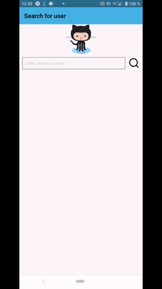

# weather-app

## Table of contents
* [General info](#general-info)
* [Technologies](#technologies)
* [Usage (gif)](#usage)
* [Setup](#setup)

## General info
With this application you can search Github users and their repositories. From every repository you can find 10 commits with author and date. By clicking commit model opens and shows more information about commit (author avatar, commit message).
Redux is used in this project for learning purposes about predictable state containers.

## Technologies
Project is created with:
* React Native "0.59.8"
* React "16.8.3"
* Expo "35.0.1"

## Usage

	
## Setup
To run the project:
  -clone project from github
  -build and run it using expo and emulator or real device.

```
$ cd ../<your folder>
$ git clone https://github.com/Ville-VeikkoN/repo-app.git

```
